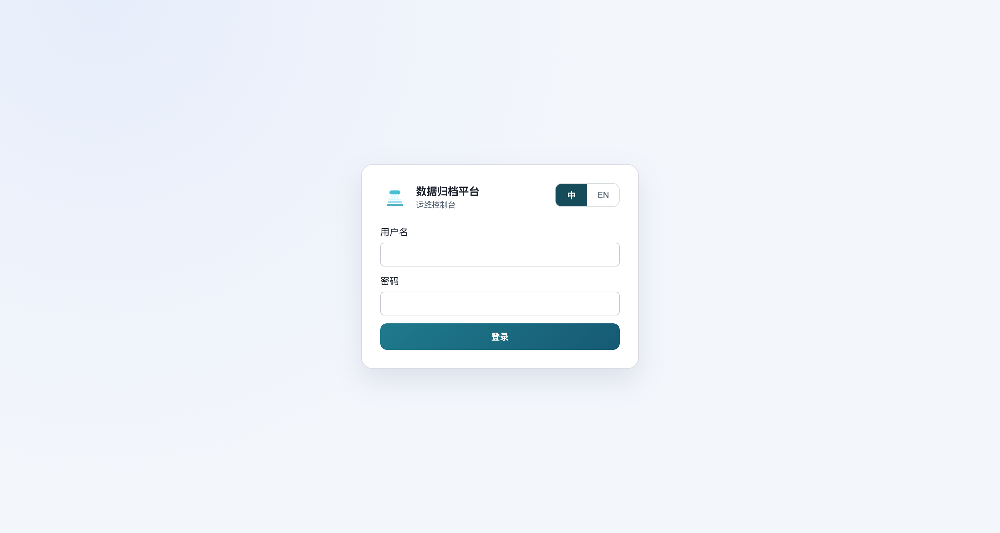
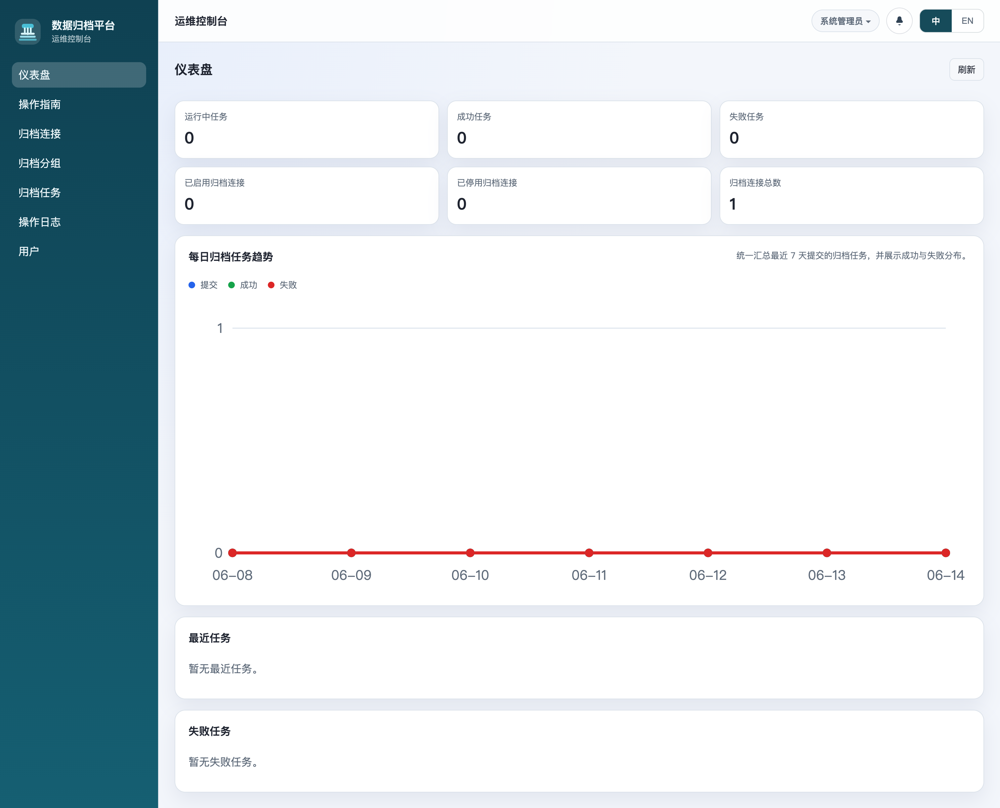
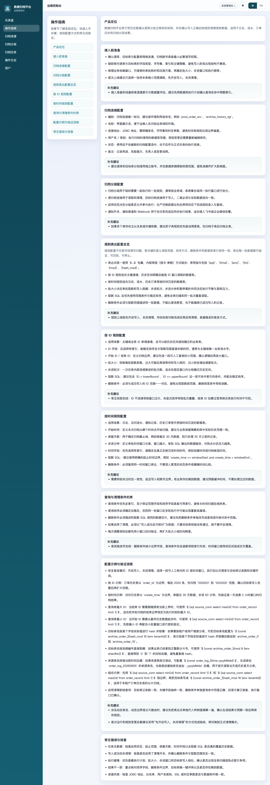
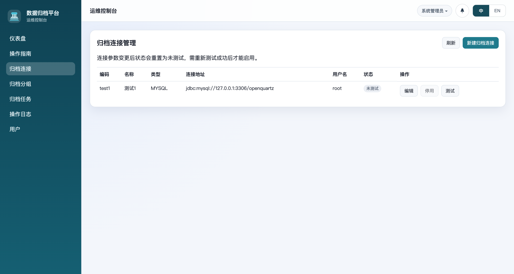
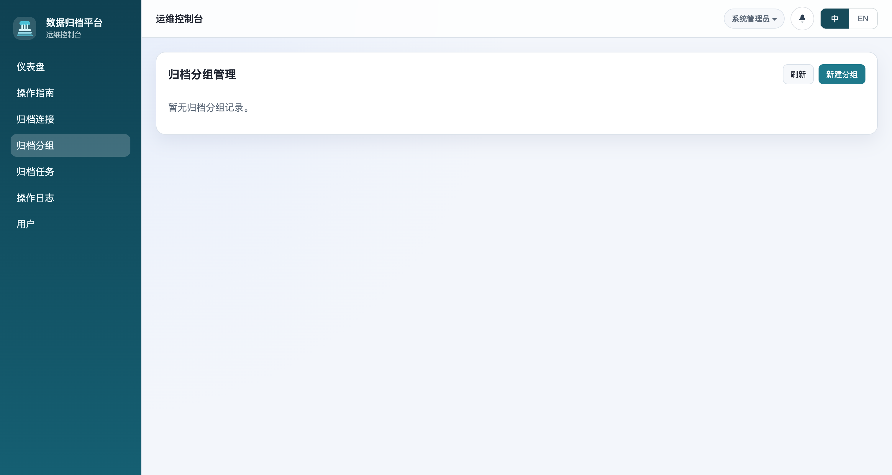
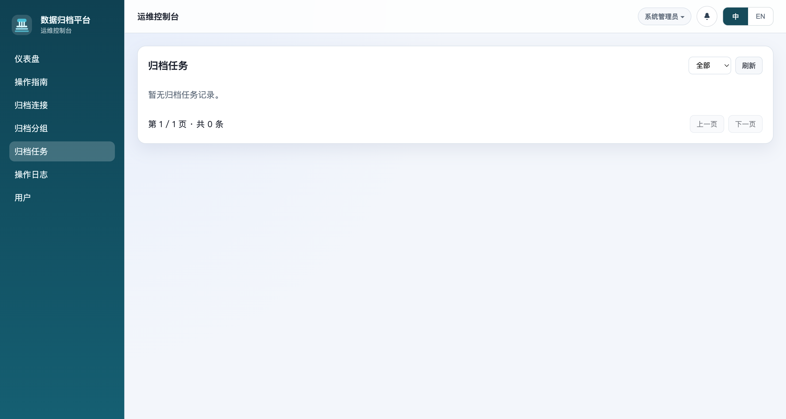
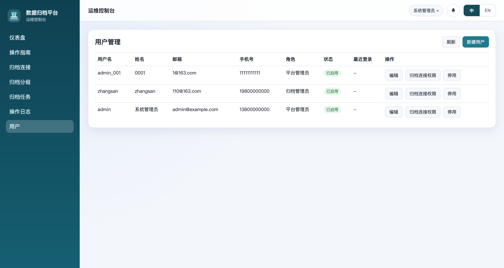
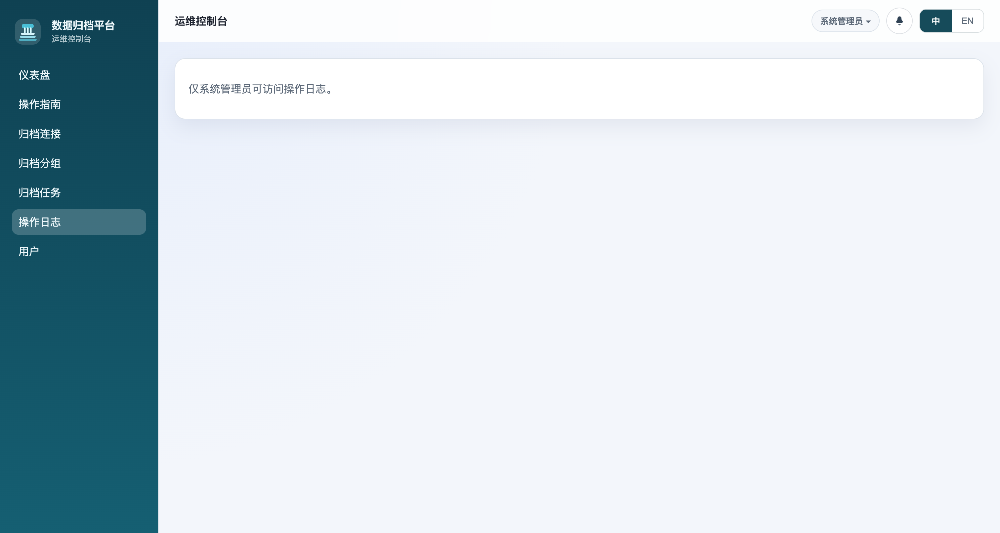

# 数据归档平台 — 新手操作指南

> 运维控制台，帮助您快速了解并上手使用数据归档平台。

---

## 1. 产品定位

数据归档平台用于把历史数据从源库分批迁移到目标库，并在确认写入正确后按规则清理源表数据，适用于日志、流水、订单历史和归档分层场景。

---

## 2. 快速开始

### 2.1 登录系统

平台启动后，浏览器访问 `http://localhost/` 自动跳转到登录页面。



**默认登录账号：**

| 用户名 | 密码     | 角色         |
|--------|----------|-------------|
| admin  | password | 系统管理员   |

点击 **登录** 按钮进入系统。



---

## 3. 核心功能模块

### 3.1 仪表盘（Dashboard）

登录后默认进入仪表盘页面，提供全局运营数据概览：

- **运行中任务** — 当前正在执行的归档任务数
- **成功任务** — 累计已完成且验证通过的归档任务
- **失败任务** — 累计执行失败的归档任务
- **归档连接统计** — 已启用 / 已停用 / 总计连接数
- **每日任务趋势图** — 近 7 天的任务提交、成功、失败分布


---

### 3.2 操作指南

内置完整的操作指南文档，包含 10 个章节，从产品定位到常见问题排查全覆盖。



章节导航：
1. 产品定位
2. 接入前准备
3. 归档连接配置
4. 归档分组配置
5. 规则表达配置总览
6. 按 ID 规则配置
7. 按时间规则配置
8. 查询与清理条件约束
9. 配置示例与验证流程
10. 常见错误与排查

---

### 3.3 归档连接管理

管理所有数据库连接（源库、目标库、配置库），支持增删改查、连接测试和权限分配。



**关键概念：**

| 字段 | 说明 |
|------|------|
| 编码 | 唯一标识，如 `prod_order_src`，建议按环境和用途命名 |
| 名称 | 界面展示名，便于运维人员识别 |
| 类型 | 数据库类型，当前支持 MYSQL |
| 连接地址 | JDBC 地址，需包含库名、字符集和时区参数 |
| 状态 | 未测试 → 已测试 → 启用 / 停用 |

**操作流程：**

1. 点击 **新建归档连接**，填写连接信息
2. 点击 **测试** 验证连接可用性
3. 点击 **启用** 使连接可被归档任务使用

---

### 3.4 归档分组管理

将多个归档规则组织成组，按业务域、执行窗口进行划分。



**分组配置要素：**

- **源归档连接** — 用于读取源数据和执行清理
- **目标归档连接** — 用于写入归档数据
- **启用状态** — 停用状态下可录入规则而不被选中执行
- **通知配置** — 任务完成后通过 Webhook 通知（可对接飞书/企业微信）

**注意事项：**
- 如果多个表存在主从关系，建议把子表规则优先级设得更高
- 生产切换前建议先在停用状态下完成规则录入与复核

---

### 3.5 归档任务管理

查看和管理所有归档任务的执行状态。



**任务状态：**

| 状态 | 说明 |
|------|------|
| 等待中 | 任务已创建，等待调度执行 |
| 运行中 | 任务正在执行数据迁移 |
| 成功 | 任务执行完成，数据已验证通过 |
| 失败 | 任务执行过程中出现错误 |
| 取消中 | 任务正在被取消 |
| 已取消 | 任务已被手动取消 |

支持按状态筛选、分页查看任务列表。

---

### 3.6 用户管理

管理系统用户和权限分配。



**系统角色：**

| 角色 | 权限 |
|------|------|
| 系统管理员 | 拥有所有权限，可管理用户和查看所有数据 |
| 平台管理员 | 可管理用户、分配归档连接权限 |
| 归档管理员 | 管理归档分组、任务和连接规则 |
| 普通用户 | 查看仪表盘和执行任务 |

**用户操作：**

- **新建用户** — 创建新用户账号，设置角色和联系方式
- **编辑** — 修改用户信息、密码、状态（启用/停用）
- **归档连接权限** — 为分配特定归档连接的读写权限
- **停用** — 禁用用户账号

---

### 3.7 操作日志

记录所有用户的操作行为，用于审计和问题追踪。



---

## 4. 快速上手流程

按照以下 5 步完成第一个归档任务：

```
Step 1: 配置归档连接
  └─ 添加源库连接（读取数据）
  └─ 添加目标库连接（写入归档数据）

Step 2: 创建归档分组
  └─ 选择源/目标连接
  └─ 设置分组名称和描述

Step 3: 配置归档规则
  └─ 按 ID 规则 或 按时间规则
  └─ 设置批大小、起止范围
  └─ 编写取数 SQL 和删除条件

Step 4: 启用分组并执行任务
  └─ 确认规则无误后启用分组
  └─ 触发任务执行
  └─ 监控任务日志

Step 5: 验证归档结果
  └─ 对比源库和目标库数据量
  └─ 抽样检查关键字段一致性
```

---

## 5. 安全最佳实践

- **最小权限原则** — 源库和目标库分别使用独立账号，限制最小必要权限
- **安全首发模式** — 首次运行先开启写入、关闭清理，确认无误后再启用清理
- **小窗口验证** — 每次调整规则后先用小窗口回归验证，再扩大批大小
- **删除条件一致** — 删除条件必须与取数范围完全一致，避免误删
- **执行窗口确认** — 提前确认业务低峰窗口，避免高峰期影响线上业务

---

## 6. 常见问题

| 问题 | 排查建议 |
|------|----------|
| 任务无数据 | 检查启用状态、起止范围、保留天数、取数 SQL 是否覆盖历史数据 |
| 写入成功但未清理 | 检查是否启用了清理开关，确认删除条件与取数范围一致 |
| 执行缓慢 | 查看执行计划、批大小、步进窗口、目标库写入吞吐 |
| 结果不一致 | 核对排序字段、删除条件边界、唯一键冲突、晚到数据 |
| 连接失败 | 检查 JDBC 地址、白名单、用户名密码、SSL 或时区参数 |

---

## 7. 联系方式

如有疑问，请联系平台运维团队。
