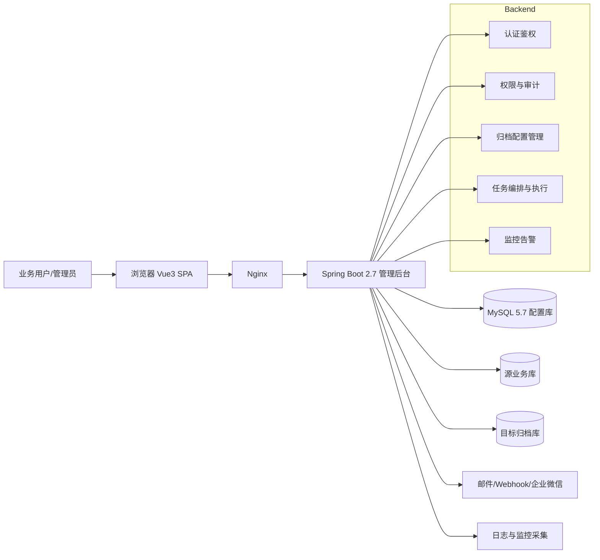
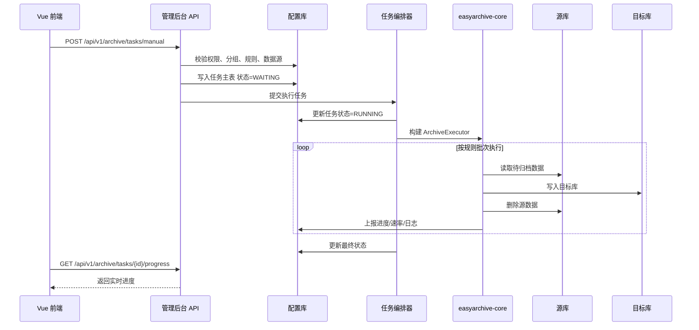
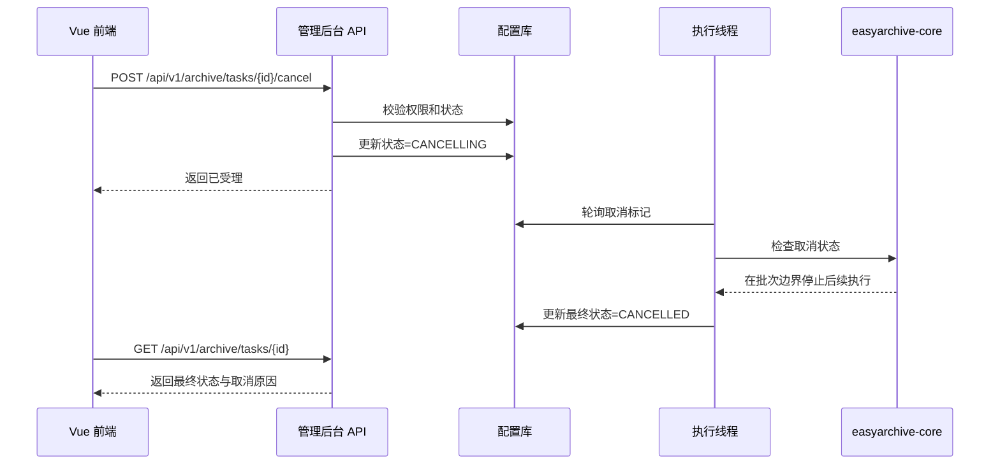

# 归档平台架构设计方案

## 1. 目标
- 基于当前 `easy-archive` 仓库，输出兼容现有归档引擎的目标架构设计。
- 目标技术栈统一为 `JDK11 + Spring Boot 2.7 + Maven + MySQL 5.7 + MyBatis + Vue3 + TypeScript`。
- 方案覆盖现状调研、代码风格统一、后端分层、前端分层、部署架构、调用时序、升级路径。

## 2. 现状调研结论

### 2.1 仓库现状
- 当前仓库是多模块 Maven 项目：`easyarchive-common`、`easyarchive-core`、`easyarchive-starter`。
- `easyarchive-common` 提供抽象接口、公共实体、异常、工具类。
- `easyarchive-core` 提供连接、规则、表达式、执行器、MySQL Source/Sink 等归档核心能力。
- `easyarchive-starter` 目前仅有最小 Spring Boot 启动类，还不是完整管理后台。
- 当前没有独立的 Vue3 前端工程，也没有完整 REST API、权限体系、管理型 Mapper 层。
- 根 `pom.xml` 已使用 JDK11 编译，但 Spring Boot 版本仍为 `2.3.2.RELEASE`，与目标栈存在差距。

### 2.2 已有领域抽象
- `BaseEntity` 已沉淀审计通用字段：`createdTime`、`updatedTime`、`creatorId`、`updaterId`、`deleted`。
- `ArchiveConnection` 已描述连接编码、类型、URL、用户名、密码、状态、备注。
- `ArchiveGroup` 已描述分组编码、名称、源目标连接、负责人、启停状态。
- `ArchiveGroupItemByTime`、`ArchiveGroupItemById` 已覆盖“按时间滚动”和“按 ID 滚动”两类核心规则。
- `ArchiveGroupExecuteTask`、`ArchiveTaskLog` 已沉淀任务执行、处理条数、速率、心跳、日志阶段等雏形。
- `ArchiveGroupExecutor -> ArchiveExecutor -> SyncExecutor` 已形成“加载规则 -> 分批读取 -> 写入目标 -> 删除源数据”的标准流程。

### 2.3 开发风格与统一标准
- 偏轻量分层，核心抽象通过接口解耦，如 `PageSource`、`Sink`、`ArchiveRuleLoader`。
- 实体模型多使用 Lombok，字段语义清晰，中文业务注释较完整。
- 核心逻辑强调可扩展与可插拔，适合作为归档引擎底座继续保留。
- 日志统一走 `Slf4j`，异常通过 `ExceptionUtils` / `EasyArchiveException` 体系处理。
- 现有 SQL 风格偏底层执行，适合“引擎保留 JDBC/SqlRunner，管理后台使用 MyBatis”双轨模式。

## 3. 目标建设原则
- 兼容优先：保留 `easyarchive-common` 与 `easyarchive-core` 作为归档引擎核心。
- 管理外置：将 `easyarchive-starter` 演进为管理后台，补齐 API、权限、审计、调度与监控。
- 配置驱动：分组、规则、连接、告警、权限全部数据库化。
- 前后端解耦：前端仅依赖标准 RESTful API 和权限码。
- 可观测优先：任务日志、进度、速率、告警、操作审计必须全链路留痕。

## 4. To-Be 模块规划

### 4.1 后端模块
- `easyarchive-common`
  - 保留公共接口、基础实体、异常、工具能力。
- `easyarchive-core`
  - 保留执行器、规则模型、表达式解析、连接创建、Source/Sink 扩展点。
  - 增强任务取消、进度上报、日志持久化适配能力。
- `easyarchive-starter`
  - 升级为 Spring Boot 2.7 管理后台。
  - 新增 `controller`、`service`、`mapper`、`config`、`security`、`schedule`、`support`、`dto`、`vo` 等包。
  - 承载认证鉴权、权限、配置管理、任务调度、日志查询、告警、监控 API。
- `easyarchive-ui`
  - 新建 Vue3 + TS 前端工程。
  - 提供登录页、系统管理、归档管理、任务中心、日志中心、监控大盘。

### 4.2 后端分层职责

#### 控制层
- 提供 RESTful API。
- 做参数校验、权限拦截、统一响应封装。
- 不直接编排复杂业务，不直接拼 SQL。

#### 业务层
- 负责登录鉴权、角色授权、数据源测试、分组树构建、规则校验、任务触发/取消、日志聚合、告警分发。
- 作为管理后台与 `easyarchive-core` 的桥接层。
- 负责事务边界和状态流转一致性。

#### 数据访问层
- 使用 MyBatis 管理配置库数据。
- 负责用户、角色、权限、数据源、分组、规则、任务、日志、监控规则、告警事件等 CRUD 与查询。
- 复杂查询收敛到 Mapper XML。

#### 支撑层
- 提供 Token 工具、密码加密、幂等控制、分页、审计上下文、脱敏、全局异常、TraceId、速率计算、取消标记检查等能力。

### 4.3 前端分层职责

#### 页面层
- 登录页、首页大盘、数据源管理、归档分组管理、规则管理、任务中心、日志中心、告警中心、角色权限管理。

#### 组件层
- 数据源表单、规则条件编辑器、权限树、日志抽屉、任务进度卡、速率图表、告警弹窗。

#### 状态层
- `authStore`：登录态、Token、用户信息、菜单权限。
- `archiveStore`：任务筛选、详情缓存、实时进度。
- `dictStore`：字典、角色、连接类型、状态枚举。

#### 路由层
- 静态路由：登录、首页、404。
- 动态路由：根据权限码注入系统管理、归档管理、监控中心菜单。
- 路由守卫负责登录态校验与未授权拦截。

## 5. 推荐目录结构

```text
easy-archive/
├── easyarchive-common/
├── easyarchive-core/
├── easyarchive-starter/
│   └── src/main/java/com/openquartz/easyarchive/starter/
│       ├── config/
│       ├── security/
│       ├── controller/
│       ├── service/
│       ├── mapper/
│       ├── model/
│       │   ├── dto/
│       │   ├── vo/
│       │   └── query/
│       ├── schedule/
│       ├── support/
│       └── convert/
└── easyarchive-ui/
    └── src/
        ├── api/
        ├── router/
        ├── store/
        ├── views/
        ├── components/
        ├── composables/
        ├── types/
        └── utils/
```

## 6. 核心领域兼容策略
- `ArchiveConnection` 升级为数据源管理核心实体，补充驱动类、Schema、最近校验时间、连接池参数。
- `ArchiveGroup` 升级为支持树结构、路径、层级、触发方式、负责人权限的数据实体。
- `ArchiveGroupItemByTime`、`ArchiveGroupItemById` 继续保留，作为引擎真实执行对象。
- 管理后台新增统一规则主表和条件明细表，由 Service 编译为核心规则对象。
- `ArchiveGroupExecuteTask` 保留为任务主实体，补齐任务编号、触发方式、取消原因、状态机字段。
- `ArchiveTaskLog` 作为执行日志实体保留，并增强阶段、上下文、速率快照字段。

## 7. 技术选型
- 后端：Spring Boot 2.7.x、Spring Security、Validation、Actuator。
- 持久层：MyBatis + MyBatis-Spring-Boot-Starter。
- 数据库：MySQL 5.7。
- 前端：Vue3 + TypeScript + Vite + Pinia + Vue Router + Axios + ECharts。
- 接口文档：OpenAPI 3。
- 调度与异步：Spring TaskExecutor + Scheduler。

## 8. 系统部署架构图



## 9. 核心时序图

### 9.1 手动触发归档



### 9.2 取消归档任务



## 10. 非功能要求
- 安全：密码采用 `BCrypt`，连接密码加密存储并前端脱敏展示。
- 并发：同一分组同一时刻只允许一个运行中任务。
- 审计：登录、登出、配置变更、任务触发/取消、授权变更全部落操作日志。
- 可恢复：失败任务保留规则快照和异常摘要，支持重试。
- 性能：任务、日志、进度查询采用复合索引；日志与进度表需要预留归档/清理策略。

## 11. 升级路径
- Phase 1：升级依赖到 Spring Boot 2.7，补齐 Web/Security/MyBatis/Validation。
- Phase 2：补齐后台管理表、Mapper、Service、Controller。
- Phase 3：增强任务编排、取消、进度、日志、监控告警。
- Phase 4：新增 Vue3 前端与大盘。
- Phase 5：补齐测试、压测、预发验证和上线门禁。

## 12. 结论
- 当前仓库最成熟的是归档内核，而不是完整业务平台。
- 目标方案采用“保留引擎 + 新增管理后台 + 新增前端 + 升级技术栈”的兼容演进路线。
