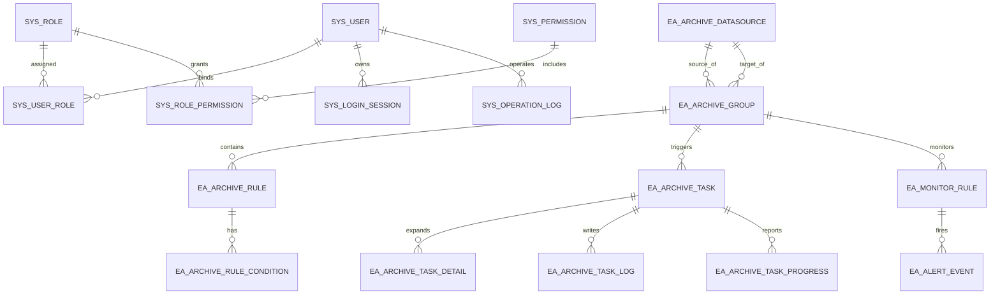

# 归档平台数据库与接口规范

## 1. 设计原则
- 全部业务表统一保留基础字段：`created_time`、`updated_time`、`creator_id`、`updater_id`、`deleted`。
- 主键统一 `BIGINT`。
- 状态字段统一使用 `TINYINT` 或 `VARCHAR` 枚举值。
- MySQL 5.7 下高频检索字段必须落独立列，避免依赖 JSON 查询。
- 日志与进度类大表优先做“业务键 + 状态/时间”复合索引。

## 2. ER 图



## 3. 核心表设计

### 3.1 权限与审计

#### `sys_user`
| 字段 | 类型 | 说明 |
| --- | --- | --- |
| id | bigint | 主键 |
| username | varchar(64) | 登录账号，唯一 |
| password | varchar(128) | BCrypt 密文 |
| real_name | varchar(64) | 姓名 |
| mobile | varchar(32) | 手机 |
| email | varchar(128) | 邮箱 |
| status | tinyint | 0-启用 1-禁用 |
| last_login_time | datetime | 最近登录时间 |
| remark | varchar(255) | 备注 |

索引：`uk_username(username)`、`idx_status(status)`。

#### `sys_role`
| 字段 | 类型 | 说明 |
| --- | --- | --- |
| id | bigint | 主键 |
| role_code | varchar(64) | 角色编码，唯一 |
| role_name | varchar(64) | 角色名称 |
| status | tinyint | 0-启用 1-禁用 |
| data_scope_type | varchar(32) | 数据范围类型 |
| remark | varchar(255) | 备注 |

#### `sys_permission`
| 字段 | 类型 | 说明 |
| --- | --- | --- |
| id | bigint | 主键 |
| permission_code | varchar(128) | 权限码，唯一 |
| permission_name | varchar(64) | 权限名 |
| permission_type | varchar(16) | MENU/BUTTON/API |
| parent_id | bigint | 父节点 |
| route_path | varchar(128) | 前端路由 |
| component | varchar(128) | 前端组件 |
| sort_no | int | 排序 |
| status | tinyint | 启用状态 |

#### `sys_user_role`
| 字段 | 类型 | 说明 |
| --- | --- | --- |
| id | bigint | 主键 |
| user_id | bigint | 用户 ID |
| role_id | bigint | 角色 ID |

唯一索引：`uk_user_role(user_id, role_id)`。

#### `sys_role_permission`
| 字段 | 类型 | 说明 |
| --- | --- | --- |
| id | bigint | 主键 |
| role_id | bigint | 角色 ID |
| permission_id | bigint | 权限 ID |

唯一索引：`uk_role_permission(role_id, permission_id)`。

#### `sys_login_session`
| 字段 | 类型 | 说明 |
| --- | --- | --- |
| id | bigint | 主键 |
| user_id | bigint | 用户 ID |
| token_id | varchar(64) | 会话标识 |
| login_ip | varchar(64) | 登录 IP |
| user_agent | varchar(255) | 终端信息 |
| login_status | tinyint | 0-成功 1-登出 2-失效 |
| expire_time | datetime | 过期时间 |
| logout_time | datetime | 登出时间 |

#### `sys_operation_log`
| 字段 | 类型 | 说明 |
| --- | --- | --- |
| id | bigint | 主键 |
| user_id | bigint | 操作人 |
| module_code | varchar(64) | 模块编码 |
| action_code | varchar(64) | 操作类型 |
| request_uri | varchar(255) | 请求路径 |
| request_method | varchar(16) | HTTP 方法 |
| request_param | text | 参数摘要 |
| response_code | varchar(32) | 响应码 |
| result_status | tinyint | 0-成功 1-失败 |
| cost_ms | bigint | 耗时 |
| client_ip | varchar(64) | IP |
| operate_time | datetime | 操作时间 |

### 3.2 归档核心

#### `ea_archive_datasource`
| 字段 | 类型 | 说明 |
| --- | --- | --- |
| id | bigint | 主键 |
| datasource_code | varchar(64) | 编码，唯一 |
| datasource_name | varchar(64) | 名称 |
| datasource_type | varchar(32) | MYSQL 等 |
| jdbc_url | varchar(255) | JDBC 地址 |
| username | varchar(128) | 用户名 |
| password_cipher | varchar(255) | 加密密码 |
| schema_name | varchar(64) | Schema |
| status | tinyint | 0-未测试 1-正常 2-异常 3-禁用 |
| last_check_time | datetime | 最近校验时间 |
| owner_user_id | bigint | 负责人 |
| remark | varchar(255) | 备注 |

索引：`uk_datasource_code(datasource_code)`、`idx_status_owner(status, owner_user_id)`。

#### `ea_archive_group`
| 字段 | 类型 | 说明 |
| --- | --- | --- |
| id | bigint | 主键 |
| parent_id | bigint | 父分组 ID |
| group_code | varchar(64) | 分组编码，唯一 |
| group_name | varchar(64) | 分组名称 |
| group_path | varchar(255) | 层级路径 |
| group_level | int | 层级 |
| source_datasource_id | bigint | 源数据源 |
| target_datasource_id | bigint | 目标数据源 |
| owner_user_id | bigint | 负责人 |
| enable_status | tinyint | 0-启用 1-禁用 |
| trigger_mode | varchar(16) | MANUAL/SCHEDULE |
| remark | varchar(255) | 备注 |

#### `ea_archive_rule`
| 字段 | 类型 | 说明 |
| --- | --- | --- |
| id | bigint | 主键 |
| group_id | bigint | 分组 ID |
| rule_code | varchar(64) | 规则编码，唯一 |
| rule_name | varchar(64) | 规则名称 |
| rule_type | varchar(16) | TIME/ID |
| priority_no | int | 优先级，组内唯一 |
| source_table | varchar(128) | 来源表 |
| target_table | varchar(128) | 目标表 |
| id_column | varchar(64) | 主键字段 |
| fetch_sql_template | text | 抓取 SQL 模板 |
| delete_where | text | 删除保护条件 |
| start_expr | varchar(255) | 起始表达式 |
| end_expr | varchar(255) | 结束表达式 |
| keep_days | int | 保留天数 |
| step_count | int | 单批大小 |
| step_rounds | int | 滚动窗口 |
| pause_ms | int | 批间停顿 |
| enable_write | tinyint | 0-启用 1-禁用 |
| enable_clean | tinyint | 0-启用 1-禁用 |
| enable_status | tinyint | 0-启用 1-禁用 |
| last_check_status | tinyint | 最近校验状态 |

索引：`uk_rule_code(rule_code)`、`uk_group_priority(group_id, priority_no)`、`idx_group_status(group_id, enable_status)`。

#### `ea_archive_rule_condition`
| 字段 | 类型 | 说明 |
| --- | --- | --- |
| id | bigint | 主键 |
| rule_id | bigint | 规则 ID |
| sort_no | int | 条件顺序 |
| logic_type | varchar(8) | AND/OR |
| field_name | varchar(64) | 字段名 |
| operator | varchar(16) | =、>、<、BETWEEN、IN、LIKE |
| value_type | varchar(16) | CONST/EXPR |
| value_expr | varchar(255) | 条件值或表达式 |
| value_expr_ext | varchar(255) | 扩展值 |
| enable_status | tinyint | 启用状态 |

#### `ea_archive_task`
| 字段 | 类型 | 说明 |
| --- | --- | --- |
| id | bigint | 主键 |
| task_no | varchar(64) | 任务编号，唯一 |
| group_id | bigint | 分组 ID |
| trigger_type | varchar(16) | MANUAL/SCHEDULE/RETRY |
| execute_status | varchar(16) | WAITING/RUNNING/SUCCESS/FAILED/CANCELLING/CANCELLED |
| start_time | datetime | 开始时间 |
| end_time | datetime | 结束时间 |
| processed_records | bigint | 已处理条数 |
| processed_speed | decimal(18,2) | 当前速率 |
| current_rule_id | bigint | 当前规则 |
| heartbeat_time | datetime | 最近心跳 |
| cancel_reason | varchar(255) | 取消原因 |
| error_msg | varchar(1000) | 错误摘要 |
| trigger_user_id | bigint | 触发人 |
| finished_flag | bigint | 终态幂等标记 |

索引：`uk_task_no(task_no)`、`idx_group_status(group_id, execute_status)`、`idx_status_heartbeat(execute_status, heartbeat_time)`。

#### `ea_archive_task_detail`
| 字段 | 类型 | 说明 |
| --- | --- | --- |
| id | bigint | 主键 |
| task_id | bigint | 任务 ID |
| rule_id | bigint | 规则 ID |
| execute_status | varchar(16) | 明细状态 |
| processed_records | bigint | 已处理条数 |
| processed_speed | decimal(18,2) | 处理速率 |
| start_time | datetime | 开始时间 |
| end_time | datetime | 结束时间 |
| error_msg | varchar(1000) | 失败摘要 |

#### `ea_archive_task_progress`
| 字段 | 类型 | 说明 |
| --- | --- | --- |
| id | bigint | 主键 |
| task_id | bigint | 任务 ID |
| snapshot_time | datetime | 快照时间 |
| execute_phase | varchar(64) | 当前阶段 |
| processed_records | bigint | 已处理条数 |
| processed_speed | decimal(18,2) | 当前速率 |
| current_rule_id | bigint | 当前规则 |
| heartbeat_flag | tinyint | 心跳正常标记 |

#### `ea_archive_task_log`
| 字段 | 类型 | 说明 |
| --- | --- | --- |
| id | bigint | 主键 |
| task_id | bigint | 任务 ID |
| rule_id | bigint | 规则 ID |
| log_type | varchar(32) | START/PROGRESS/FINISH/ERROR/CANCEL |
| log_level | varchar(16) | INFO/WARN/ERROR |
| execute_phase | varchar(64) | 执行阶段 |
| log_content | text | 日志内容 |
| processed_count | bigint | 已处理数 |
| process_speed | decimal(18,2) | 处理速率 |
| log_time | datetime | 日志时间 |

### 3.3 监控告警

#### `ea_monitor_rule`
| 字段 | 类型 | 说明 |
| --- | --- | --- |
| id | bigint | 主键 |
| rule_name | varchar(64) | 监控规则名称 |
| group_id | bigint | 关联分组，可空 |
| metric_code | varchar(32) | FAILURE_COUNT/HEARTBEAT_TIMEOUT/SPEED_LOW |
| threshold_value | decimal(18,2) | 阈值 |
| compare_type | varchar(8) | GT/LT/GTE/LTE |
| channel_type | varchar(32) | EMAIL/WEBHOOK/WECOM |
| webhook_url | varchar(255) | 渠道地址 |
| silence_minutes | int | 静默时间 |
| enable_status | tinyint | 启停状态 |

#### `ea_alert_event`
| 字段 | 类型 | 说明 |
| --- | --- | --- |
| id | bigint | 主键 |
| monitor_rule_id | bigint | 监控规则 ID |
| task_id | bigint | 关联任务 |
| alert_level | varchar(16) | INFO/WARN/CRITICAL |
| alert_status | varchar(16) | OPEN/NOTIFIED/RECOVERED/CLOSED |
| alert_content | varchar(1000) | 告警内容 |
| notify_status | tinyint | 0-待发送 1-成功 2-失败 |
| trigger_time | datetime | 触发时间 |
| recover_time | datetime | 恢复时间 |
| handler_user_id | bigint | 处理人 |

## 4. RESTful 接口规范

### 4.1 统一约定
- 基础路径：`/api/v1`
- 鉴权头：`Authorization: Bearer <token>`
- 统一响应：

```json
{
  "code": "SUCCESS",
  "message": "OK",
  "requestId": "202605240001",
  "data": {}
}
```

- 分页响应：

```json
{
  "code": "SUCCESS",
  "message": "OK",
  "requestId": "202605240001",
  "data": {
    "records": [],
    "pageNo": 1,
    "pageSize": 20,
    "total": 100
  }
}
```

### 4.2 HTTP 状态码
| 状态码 | 语义 |
| --- | --- |
| 200 | 成功 |
| 201 | 创建成功 |
| 400 | 参数错误 |
| 401 | 未登录或 Token 失效 |
| 403 | 无权限 |
| 404 | 资源不存在 |
| 409 | 状态冲突 |
| 422 | 业务校验失败 |
| 500 | 系统异常 |

### 4.3 业务状态码建议
- `SUCCESS`
- `AUTH_INVALID`
- `AUTH_FORBIDDEN`
- `PARAM_INVALID`
- `DATA_NOT_FOUND`
- `DATA_CONFLICT`
- `RULE_VALIDATE_FAILED`
- `TASK_ALREADY_RUNNING`
- `TASK_CANNOT_CANCEL`
- `DATASOURCE_TEST_FAILED`
- `SYSTEM_ERROR`

## 5. 接口清单

### 5.1 认证与用户
- `POST /auth/login`：登录
- `POST /auth/logout`：登出
- `GET /auth/me`：当前用户信息
- `GET /users`：用户分页查询
- `POST /users`：新建用户
- `PUT /users/{id}`：编辑用户
- `PATCH /users/{id}/status`：启停用户
- `GET /roles`：角色查询
- `POST /roles`：新建角色
- `PUT /roles/{id}`：编辑角色
- `PUT /roles/{id}/permissions`：绑定权限
- `GET /permissions/tree`：权限树
- `GET /operation-logs`：操作日志查询

### 5.2 数据源管理
- `GET /archive/datasources`
- `POST /archive/datasources`
- `GET /archive/datasources/{id}`
- `PUT /archive/datasources/{id}`
- `PATCH /archive/datasources/{id}/status`
- `POST /archive/datasources/test`

### 5.3 分组与规则
- `GET /archive/groups/tree`
- `POST /archive/groups`
- `PUT /archive/groups/{id}`
- `GET /archive/groups/{id}`
- `PATCH /archive/groups/{id}/status`
- `GET /archive/rules`
- `POST /archive/rules`
- `GET /archive/rules/{id}`
- `PUT /archive/rules/{id}`
- `POST /archive/rules/{id}/validate`
- `PATCH /archive/rules/{id}/status`

### 5.4 任务中心
- `GET /archive/tasks`
- `POST /archive/tasks/manual`
- `GET /archive/tasks/{id}`
- `GET /archive/tasks/{id}/progress`
- `GET /archive/tasks/{id}/logs`
- `POST /archive/tasks/{id}/cancel`

### 5.5 可视化与告警
- `GET /dashboard/summary`
- `GET /dashboard/trend`
- `GET /dashboard/top-risk-groups`
- `GET /monitor/rules`
- `POST /monitor/rules`
- `PUT /monitor/rules/{id}`
- `GET /alerts`
- `GET /alerts/{id}`
- `POST /alerts/{id}/handle`

## 6. 关键请求示例

### 登录

```json
{
  "username": "admin",
  "password": "123456"
}
```

### 手动触发归档

```json
{
  "groupId": 1001,
  "triggerReason": "月底补归档"
}
```

### 取消归档

```json
{
  "cancelReason": "目标库空间不足"
}
```

### 新建规则

```json
{
  "groupId": 1001,
  "ruleCode": "ORDER_ARCHIVE_TIME",
  "ruleName": "订单历史归档",
  "ruleType": "TIME",
  "priorityNo": 10,
  "sourceTable": "t_order",
  "targetTable": "t_order_archive",
  "idColumn": "id",
  "fetchSqlTemplate": "select id from t_order where create_time >= ? and create_time < ? and status = 'DONE'",
  "deleteWhere": "status = 'DONE'",
  "keepDays": 180,
  "stepCount": 1000,
  "stepRounds": 5000,
  "pauseMs": 100,
  "enableWrite": 0,
  "enableClean": 0
}
```

## 7. 性能建议
- `ea_archive_task_log` 和 `ea_archive_task_progress` 需要预留分表或归档策略。
- 所有列表接口默认分页，日志接口强制分页。
- 连接测试与规则校验接口应加限流。
- 任务进度展示使用主表聚合值 + 快照明细，避免前端高频全量查日志。
